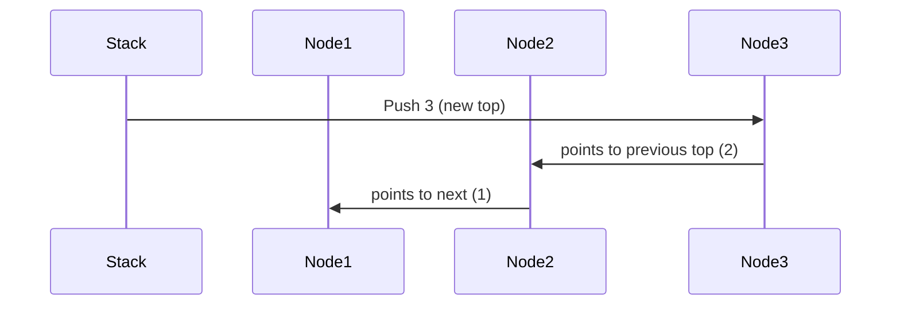
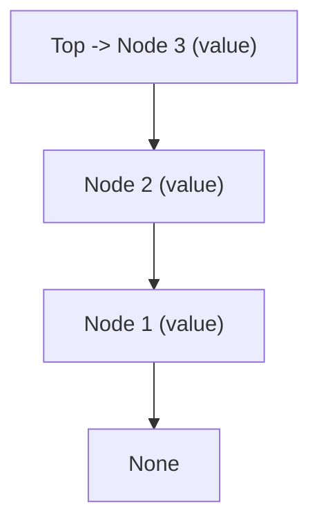
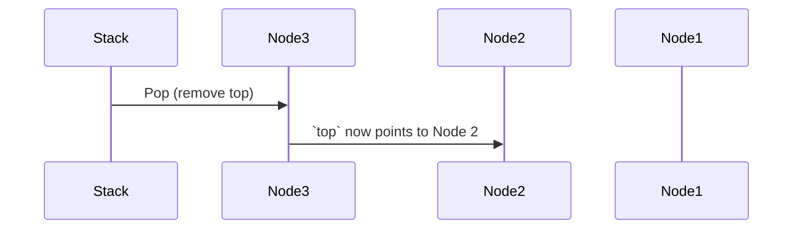
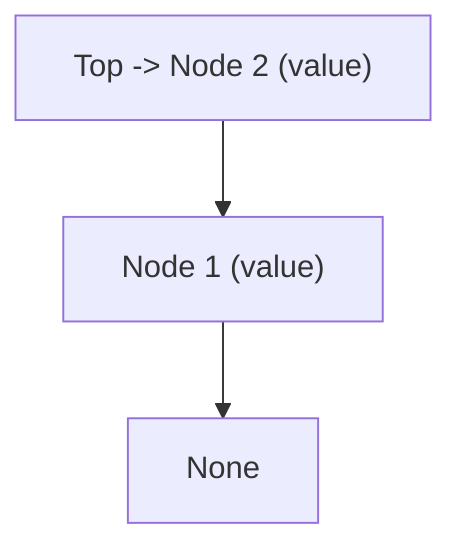

A **Stack** is a linear data structure that follows a specific order for operations. The order may be **LIFO** (Last In, First Out) or **FILO** (First In, Last Out):

- **LIFO** means the element added last is removed first.
- **FILO** means the element added first is removed last.

## Basic Operations

1. **Push**: Add an element to the top of the stack.
2. **Pop**: Remove the top element from the stack.
3. **Peek**: View the top element without removing it.
4. **IsEmpty**: Check if the stack has no elements.
5. **IsFull**: Check if the stack has reached its maximum capacity.

Each operation typically has the following time complexities:

- **Push**: O(1)
- **Pop**: O(1)
- **Peek**: O(1)
- **IsEmpty / IsFull**: O(1)

## Singly Linked List Implementation

In this project, the Stack data structure is implemented using a **Singly Linked List**. This approach offers efficient insertion and deletion at the beginning of the list. Each element, or **node**, in the stack is linked to the next node, allowing the **top** element of the stack to be accessed in constant time.

### Key Points:

- The `top` variable keeps track of the top element.
- New elements are added and removed only at the `top`.
- This implementation of Stack is dynamic, meaning it grows as needed without a fixed maximum size.

## Push Operation

## Pop Operation

